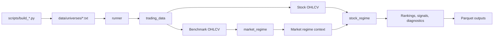
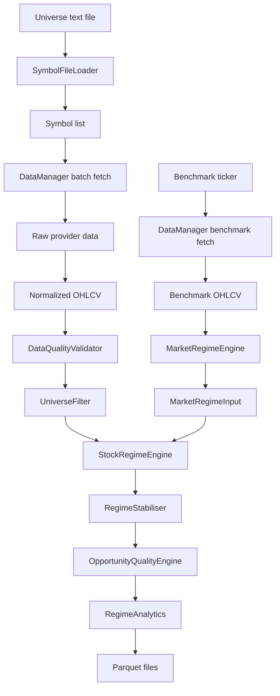
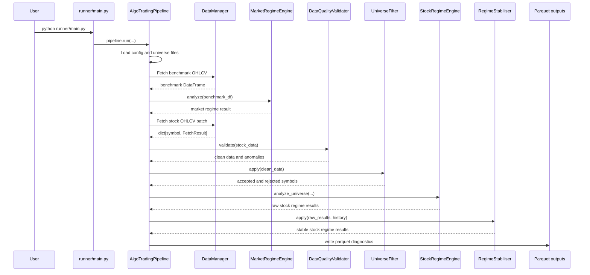
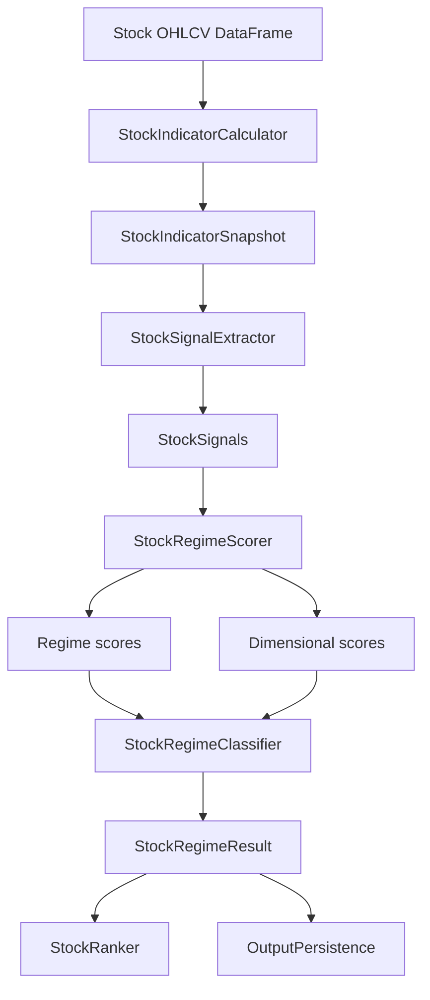
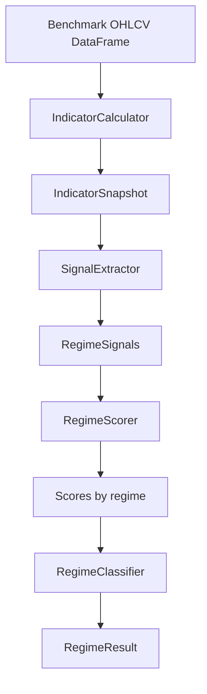

# Strategy Bot POC

An end-to-end algorithmic trading research pipeline for fetching market data, classifying broad market regimes, classifying individual stock regimes, ranking opportunities, and persisting diagnostics to parquet.

The project is organized as small modules with clear responsibilities:

- `trading_data`: fetches and normalizes OHLCV data.
- `market_regime`: classifies benchmark market conditions.
- `stock_regime`: classifies, filters, ranks, stabilizes, and scores individual stocks.
- `runner`: orchestrates the full pipeline.
- `scripts`: builds static universe symbol files.
- `data`: stores universe input files.

## Project Goals

This proof of concept is designed to answer a complete trading-research question:

1. What is the current broad market regime?
2. Which stocks in the configured universe have valid, liquid, recent data?
3. Which stock regime is each symbol currently in?
4. Which symbols rank highest by trend, momentum, volatility, and opportunity quality?
5. What diagnostics explain the result?
6. What parquet files can be used for inspection, backtesting, reporting, or downstream automation?

## Repository Structure

```text
.
├── data/
│   └── universes/
│       ├── nifty500.txt
│       └── sp500.txt
├── market_regime/
│   ├── config/
│   ├── src/
│   ├── tests/
│   ├── main.py
│   └── README.md
├── runner/
│   ├── config/
│   ├── output/
│   ├── tests/
│   ├── main.py
│   ├── pipeline.py
│   ├── read_parquet_outputs.py
│   └── README.md
├── scripts/
│   ├── build_nifty500.py
│   ├── build_sp500.py
│   └── README.md
├── stock_regime/
│   ├── analytics/
│   ├── config/
│   ├── filters/
│   ├── quality/
│   ├── src/
│   ├── stability/
│   ├── tests/
│   ├── validation/
│   ├── main.py
│   └── README.md
└── trading_data/
    ├── cache/
    ├── examples/
    ├── providers/
    ├── symbols/
    ├── manager.py
    └── README.md
```

## Module Summary

| Module | Purpose | Main Entry Point |
|---|---|---|
| `data` | Stores static universe files with one ticker per line. | `data/universes/*.txt` |
| `scripts` | Builds universe files from external index constituent sources. | `scripts/build_nifty500.py`, `scripts/build_sp500.py` |
| `trading_data` | Fetches, normalizes, caches, and batch-loads OHLCV data. | `trading_data.DataManager` |
| `market_regime` | Classifies benchmark OHLCV into a broad market regime. | `MarketRegimeEngine` |
| `stock_regime` | Classifies stocks, applies filters, ranks results, and persists diagnostics. | `StockRegimeEngine` |
| `runner` | Runs the full platform workflow across configured universes. | `AlgoTradingPipeline` |

Detailed module docs:

- [data/README.md](data/README.md)
- [scripts/README.md](scripts/README.md)
- [trading_data/README.md](trading_data/README.md)
- [market_regime/README.md](market_regime/README.md)
- [stock_regime/README.md](stock_regime/README.md)
- [runner/README.md](runner/README.md)

## High-Level Architecture



## End-To-End Data Flow

1. Universe files define which symbols are eligible for processing.
2. The runner reads `runner/config/pipeline.yaml`.
3. For each universe, the runner loads symbols from `data/universes/`.
4. `trading_data.DataManager` fetches benchmark OHLCV and stock OHLCV.
5. Benchmark OHLCV flows into `market_regime.MarketRegimeEngine`.
6. The market regime result becomes context for stock classification.
7. Stock OHLCV flows through data quality validation.
8. Cleaned stock data flows through universe filters.
9. Accepted stock data flows into `stock_regime.StockRegimeEngine`.
10. Stock results are ranked, stabilized, quality-scored, analyzed, and persisted.



## Full Code Flow

The full pipeline is implemented in `runner/pipeline.py`.



## Stock Classification Flow

Inside `stock_regime`, each accepted stock follows this path:



## Market Classification Flow

Inside `market_regime`, the benchmark follows this path:



## Inputs

### Configuration

Main pipeline configuration:

```text
runner/config/pipeline.yaml
```

Important sections:

- `data`: start date, end date, cache settings, retries.
- `universes`: universe names, benchmark tickers, symbol sources, exchanges.
- `symbol_loading`: symbol limits and missing-file behavior.
- `output`: persistence, output root, logs.
- `market_regime_config`: optional custom market regime config path.
- `stock_regime_config`: optional custom stock regime config path.

Engine-specific configs:

```text
market_regime/config/config.yaml
stock_regime/config/config.yaml
```

### Universe Files

```text
data/universes/nifty500.txt
data/universes/sp500.txt
```

Format:

```text
RELIANCE.NS
TCS.NS
INFY.NS
```

Rules:

- One ticker per line.
- Blank lines are ignored.
- Comment lines beginning with `#` are ignored.
- Symbols should match the active data provider format.

### Market Data

Market data is fetched through `trading_data.DataManager` and normalized to:

```text
index: DatetimeIndex named date
columns: open, high, low, close, volume
```

## Outputs

The pipeline writes parquet outputs when persistence is enabled.

Current config uses:

```yaml
output:
  root_dir: "output"
  persist: true
```

Because `runner/main.py` runs from the project root unless changed, output is typically written under:

```text
output/
```

Existing local runs may also have files under:

```text
runner/output/
```

Common output layout:

```text
output/
├── analytics/YYYY-MM-DD/current_episodes.parquet
├── classifications/YYYY-MM-DD/classifications.parquet
├── filters/YYYY-MM-DD/*_filter_summary.parquet
├── filters/YYYY-MM-DD/*_rejected.parquet
├── indicators/YYYY-MM-DD/indicators.parquet
├── logs/*.log
├── quality/YYYY-MM-DD/*_quality.parquet
├── quality/YYYY-MM-DD/*_quality_scores.parquet
├── rankings/YYYY-MM-DD/trend_ranking.parquet
├── rankings/YYYY-MM-DD/momentum_ranking.parquet
├── rankings/YYYY-MM-DD/volatility_ranking.parquet
├── regime_history/regime_history.parquet
├── scoring/YYYY-MM-DD/*_score_dist.parquet
├── signals/YYYY-MM-DD/signals.parquet
└── stable_classifications/YYYY-MM-DD/*_stable.parquet
```

## Output Inspection

Use the parquet reader utility:

```bash
python runner/read_parquet_outputs.py
```

Useful variants:

```bash
python runner/read_parquet_outputs.py --rows 20
python runner/read_parquet_outputs.py --output-dir runner/output
python runner/read_parquet_outputs.py --show-all-columns
```

## Setup

Python 3.10+ is recommended.

Install dependencies for the full pipeline:

```bash
pip install -r trading_data/requirements.txt
pip install -r market_regime/requirements.txt
pip install -r stock_regime/requirements.txt
```

The project uses:

- `pandas`
- `numpy`
- `pyyaml`
- `pyarrow`
- `pandas-ta`
- `yfinance`
- `pytest`

## Running The Project

### 1. Refresh Universe Files

```bash
python scripts/build_nifty500.py
python scripts/build_sp500.py
```

If an online source blocks automated requests, use a manually downloaded CSV:

```bash
python scripts/build_nifty500.py --csv /path/to/ind_nifty500list.csv
python scripts/build_sp500.py --csv /path/to/sp500.csv
```

### 2. Run Market Regime Demo

Synthetic offline data:

```bash
python market_regime/main.py
```

Real data:

```bash
python market_regime/main.py --real --symbol NIFTY50
```

### 3. Run Stock Regime Demo

```bash
python stock_regime/main.py
```

### 4. Run Full Pipeline

```bash
python runner/main.py
```

Programmatic usage:

```python
from runner.pipeline import AlgoTradingPipeline

pipeline = AlgoTradingPipeline()
output = pipeline.run(
    universes=["NIFTY500"],
    persist=True,
)
```

## Configuration Example

`runner/config/pipeline.yaml` connects universes to benchmark symbols and universe files:

```yaml
universes:
  NIFTY500:
    benchmark: "^NSEI"
    symbol_source: "data/universes/nifty500.txt"
    exchange: "NSE"

  SP500:
    benchmark: "^GSPC"
    symbol_source: "data/universes/sp500.txt"
    exchange: "NYSE"
```

For quick testing, limit the number of symbols:

```yaml
symbol_loading:
  max_symbols: 20
```

## Data Contracts

### OHLCV DataFrame

All downstream engines expect:

| Column | Meaning |
|---|---|
| `open` | Opening price |
| `high` | Session high |
| `low` | Session low |
| `close` | Closing or adjusted closing price |
| `volume` | Traded volume |

The index should be a chronological `DatetimeIndex`.

### Market Regime Result

Produced by `market_regime`:

```json
{
  "regime": "BULLISH_TREND",
  "confidence": 0.8,
  "signals": {},
  "scores": {}
}
```

### Stock Regime Result

Produced by `stock_regime`:

```text
symbol
market
stock_regime
confidence
trend_score
momentum_score
volatility_score
indicator snapshot
signals
regime scores
error, if invalid
```

## Testing

Run module tests:

```bash
pytest market_regime/tests -v
pytest stock_regime/tests -v
pytest runner/tests -v
```

Run all tests:

```bash
pytest -v
```

## Notes And Caveats

- Online data fetching depends on provider availability and network access.
- The default active data provider is Yahoo Finance through `yfinance`.
- Some provider files are skeletons for future Zerodha, Polygon, or IBKR integration.
- Parquet reading and writing requires `pyarrow`.
- `data/` is ignored by the current `.gitignore`, so its README and universe files may need force-adding if they should be committed.
- `runner/output/` contains generated artifacts from previous runs and should be treated as runtime output.
