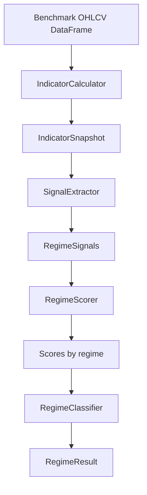

# market_regime Module

## Purpose

The `market_regime` module classifies the overall market condition for a benchmark index such as NIFTY 50 or S&P 500. It turns daily OHLCV data into a structured regime result that downstream modules use as market context.

It is intended to answer:

- Is the broad market bullish, bearish, sideways, volatile, quiet, or uncertain?
- How confident is that classification?
- Which technical signals contributed to the decision?

## What It Does

The main public class is `market_regime.src.engine.MarketRegimeEngine`.

It uses a scoring-based pipeline:

1. Compute indicators from benchmark OHLCV.
2. Convert indicator values into boolean regime signals.
3. Score each candidate market regime.
4. Select the winning regime with confidence.
5. Return a typed `RegimeResult` or JSON-compatible dictionary.

Supported regimes include:

| Regime | Meaning |
|---|---|
| `BULLISH_TREND` | Price and moving averages indicate an upward trend. |
| `BEARISH_TREND` | Price and moving averages indicate a downward trend. |
| `SIDEWAYS` | Trend strength is weak or moving averages are flat. |
| `VOLATILE` | ATR indicates elevated volatility. |
| `QUIET` | ATR indicates compressed volatility. |
| `UNCERTAIN` | No candidate passes the configured confidence threshold. |

## Inputs And Outputs

### Inputs

`MarketRegimeEngine.analyze()` expects a pandas DataFrame:

```text
index: DatetimeIndex
columns: open, high, low, close, volume
```

The DataFrame normally comes from:

- `trading_data.DataManager`
- synthetic data in `market_regime/main.py`
- any caller that provides normalized OHLCV data

Configuration is loaded from:

```text
market_regime/config/config.yaml
```

or from a custom config path passed to `MarketRegimeEngine(config_path=...)`.

### Outputs

In memory:

- `RegimeResult`
- JSON string from `analyze_to_json()`
- `list[RegimeResult]` from `analyze_rolling()`

Typical output dictionary:

```json
{
  "regime": "BULLISH_TREND",
  "confidence": 0.8,
  "signals": {
    "price_above_ema200": true,
    "ema20_above_ema50": true,
    "adx_strong": true
  },
  "scores": {
    "BULLISH_TREND": 0.8,
    "BEARISH_TREND": 0.0,
    "SIDEWAYS": 0.0,
    "VOLATILE": 0.25,
    "QUIET": 0.0
  }
}
```

## Code Flow

Primary flow inside `MarketRegimeEngine.analyze()`:

1. `IndicatorCalculator.compute()` calculates EMA, ADX, ATR, volume averages, and related values.
2. `SignalExtractor.extract()` creates boolean signals such as `adx_strong`, `atr_high`, and `price_above_ema200`.
3. `RegimeScorer.score_all()` applies configured weights to produce a score per regime.
4. `RegimeClassifier.classify()` chooses the winning regime or returns `UNCERTAIN`.
5. The engine returns a `RegimeResult`.

## Flow Diagram



## Main Files

| File | Responsibility |
|---|---|
| `main.py` | Demo runner using synthetic data or real data through `trading_data`. |
| `src/engine.py` | Public orchestrator. |
| `src/indicators.py` | Indicator calculations. |
| `src/signals.py` | Converts indicators to boolean signals. |
| `src/scorer.py` | Weighted scoring for each market regime. |
| `src/classifier.py` | Final regime selection. |
| `src/models.py` | Dataclasses and enums used across the module. |
| `src/config_loader.py` | Loads YAML config into an object-like structure. |
| `config/config.yaml` | Thresholds and scoring weights. |
| `tests/test_engine.py` | Tests for the engine. |

## Usage

Synthetic offline demo:

```bash
python market_regime/main.py
```

Real-data demo:

```bash
python market_regime/main.py --real --symbol NIFTY50
```

Programmatic usage:

```python
from market_regime.src import MarketRegimeEngine

engine = MarketRegimeEngine()
result = engine.analyze(benchmark_df)
print(result.to_dict())
```

Rolling analysis:

```python
results = engine.analyze_rolling(benchmark_df)
```

## Relationship To Other Modules

`runner` uses this module before stock classification. The market regime output is converted into `stock_regime.src.models.MarketRegimeInput` and passed into the stock regime engine so individual stock decisions can be interpreted in the context of the broad market.
