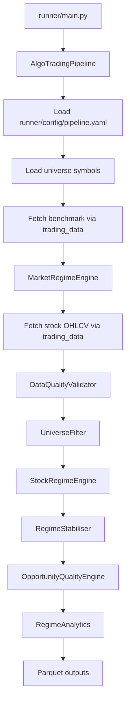

# runner Module

## Purpose

The `runner` module is the end-to-end orchestration layer for the trading platform proof of concept. It connects the data layer, market regime engine, stock regime engine, quality checks, universe filters, stability logic, analytics, and parquet persistence into one runnable pipeline.

Use this module when you want to run the whole workflow for configured universes such as `NIFTY500` or `SP500`.

## What It Does

The main orchestrator is `runner.pipeline.AlgoTradingPipeline`.

For each configured universe it:

1. Loads symbols from `data/universes/*.txt`.
2. Fetches benchmark OHLCV data.
3. Classifies the benchmark market regime.
4. Fetches OHLCV data for every stock in the universe.
5. Validates and corrects data quality issues.
6. Applies history, price, and liquidity filters.
7. Runs stock regime classification.
8. Applies regime stability smoothing and hysteresis.
9. Scores opportunity quality.
10. Writes diagnostics and outputs to parquet.
11. Runs regime analytics.

## Inputs And Outputs

### Inputs

Primary configuration:

```text
runner/config/pipeline.yaml
```

Important config sections:

- `data`: date range, cache directory, retry settings.
- `universes`: benchmark ticker, symbol source, exchange.
- `symbol_loading`: max symbol count and missing-file behavior.
- `output`: root output directory, persistence flag, logging.
- `market_regime_config` and `stock_regime_config`: optional config overrides.

Symbol files:

```text
data/universes/nifty500.txt
data/universes/sp500.txt
```

Runtime inputs:

- Daily benchmark OHLCV from `trading_data`.
- Daily stock OHLCV from `trading_data`.
- Market and stock regime config files.

### Outputs

When `persist=True`, parquet files are written under the configured output root. With the current config, the path is `output/` relative to the process working directory.

Common output categories:

```text
output/
├── analytics/YYYY-MM-DD/current_episodes.parquet
├── classifications/YYYY-MM-DD/classifications.parquet
├── filters/YYYY-MM-DD/*_filter_summary.parquet
├── filters/YYYY-MM-DD/*_rejected.parquet
├── indicators/YYYY-MM-DD/indicators.parquet
├── quality/YYYY-MM-DD/*_quality.parquet
├── quality/YYYY-MM-DD/*_quality_scores.parquet
├── rankings/YYYY-MM-DD/trend_ranking.parquet
├── rankings/YYYY-MM-DD/momentum_ranking.parquet
├── rankings/YYYY-MM-DD/volatility_ranking.parquet
├── regime_history/regime_history.parquet
├── scoring/YYYY-MM-DD/*_score_dist.parquet
├── signals/YYYY-MM-DD/signals.parquet
└── stable_classifications/YYYY-MM-DD/*_stable.parquet
```

The helper script `runner/read_parquet_outputs.py` recursively previews these parquet files.

## Code Flow

Entry points:

- `runner/main.py`: runnable demo for a full pipeline run.
- `runner/pipeline.py`: production-style orchestrator and public API.
- `runner/read_parquet_outputs.py`: utility to inspect parquet outputs.

Typical run:

```bash
python runner/main.py
```

Programmatic usage:

```python
from runner.pipeline import AlgoTradingPipeline

pipeline = AlgoTradingPipeline()
output = pipeline.run(universes=["NIFTY500"], persist=True)
```

## Flow Diagram



## Main Files

| File | Responsibility |
|---|---|
| `main.py` | Runs the full pipeline and prints summaries. |
| `pipeline.py` | Coordinates every module in the end-to-end workflow. |
| `config/pipeline.yaml` | Configures universes, date range, output paths, and engine overrides. |
| `read_parquet_outputs.py` | Reads every parquet file under an output folder and prints previews. |
| `tests/test_integration.py` | Integration tests for the pipeline. |

## Output Inspection

Install dependencies first:

```bash
pip install -r stock_regime/requirements.txt
```

Then inspect outputs:

```bash
python runner/read_parquet_outputs.py --rows 10 --show-all-columns
```
