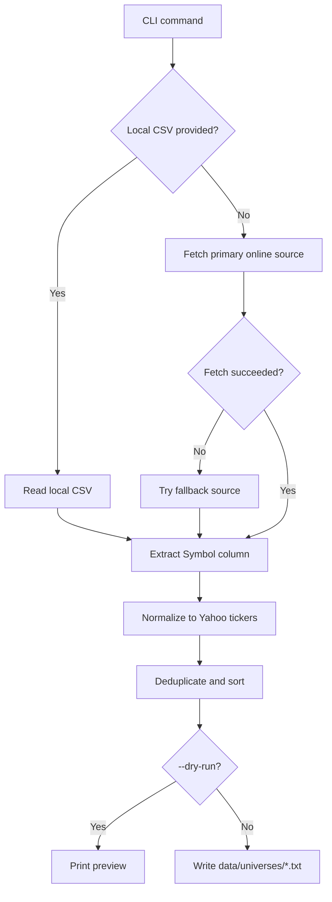

# scripts Module

## Purpose

The `scripts` module contains utility scripts that build the static universe files consumed by the runner. These scripts are intentionally separate from the live pipeline: the pipeline reads already-built symbol files and does not fetch index constituents during a trading run.

Current scripts:

```text
scripts/
├── build_nifty500.py
└── build_sp500.py
```

## What It Does

### `build_nifty500.py`

Fetches NIFTY 500 constituents, converts NSE symbols into Yahoo Finance tickers, and writes:

```text
data/universes/nifty500.txt
```

Primary source:

- NSE India constituent CSV.

Fallbacks:

- Alternate NSE endpoint.
- `nsepython`, if installed.
- Local CSV via `--csv`.

### `build_sp500.py`

Fetches S&P 500 constituents, converts ticker class separators for Yahoo Finance, and writes:

```text
data/universes/sp500.txt
```

Sources tried:

- Wikipedia S&P 500 constituents table.
- DataHub CSV.
- Local CSV via `--csv`.

## Inputs And Outputs

### Inputs

External data sources:

- NSE India CSV for NIFTY 500.
- Wikipedia or DataHub for S&P 500.

Optional local CSV:

```bash
python scripts/build_nifty500.py --csv /path/to/ind_nifty500list.csv
python scripts/build_sp500.py --csv /path/to/sp500.csv
```

### Outputs

Plain text universe files:

```text
data/universes/nifty500.txt
data/universes/sp500.txt
```

Each output contains one Yahoo-compatible ticker per line.

## Code Flow

1. Parse CLI arguments.
2. Fetch constituent table from the preferred source.
3. Fall back to alternate sources if needed.
4. Detect the symbol column.
5. Normalize tickers for Yahoo Finance.
6. Deduplicate and sort.
7. Write the target universe file, unless `--dry-run` is used.

## Flow Diagram



## Usage

Standard refresh:

```bash
python scripts/build_nifty500.py
python scripts/build_sp500.py
```

Preview without writing:

```bash
python scripts/build_nifty500.py --dry-run
python scripts/build_sp500.py --dry-run
```

Custom output path:

```bash
python scripts/build_sp500.py --output data/universes/sp500_test.txt
```

## Operational Notes

Run these scripts whenever index constituents are rebalanced or when you want to refresh the trading universe. Because online sources can block automated requests, both scripts support local CSV input for manual fallback.
