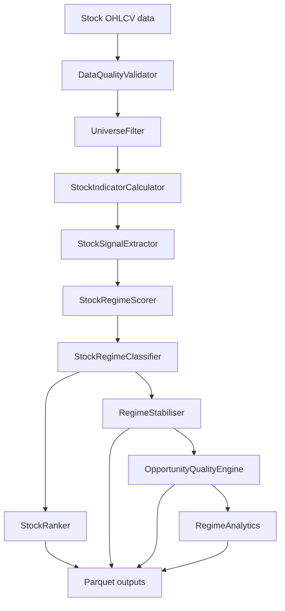

# stock_regime Module

## Purpose

The `stock_regime` module classifies individual stocks within a market universe. It uses normalized OHLCV data, benchmark context, and the current market regime to produce per-symbol stock regimes, dimensional scores, rankings, stability-adjusted regimes, quality diagnostics, and parquet outputs.

This module answers questions like:

- Which stocks are in strong uptrends or downtrends?
- Which stocks have high momentum or volatility expansion?
- Which classifications are stable enough to trust today?
- Which symbols should be rejected because of bad data, poor liquidity, stale history, or price constraints?

## What It Does

The primary engine is `stock_regime.src.engine.StockRegimeEngine`.

For each stock it:

1. Computes technical indicators.
2. Extracts boolean stock signals.
3. Scores candidate stock regimes.
4. Chooses the winning stock regime.
5. Builds dimensional scores for trend, momentum, and volatility.

The wider module also provides:

- Data quality validation and correction.
- Universe filtering by history, price, and liquidity.
- Regime stability smoothing and hysteresis.
- Opportunity quality scoring.
- Regime analytics.
- Parquet persistence.

## Inputs And Outputs

### Inputs

`StockRegimeEngine.analyze_universe()` expects:

```python
stock_data: dict[str, pandas.DataFrame]
market_regime: MarketRegimeInput
benchmark_data: pandas.DataFrame | None
market_label: str
run_date: date | None
persist: bool
```

Each stock DataFrame should have:

```text
index: DatetimeIndex
columns: open, high, low, close, volume
```

The `market_regime` input is normally produced by `market_regime.MarketRegimeEngine` and converted through `MarketRegimeInput.from_dict()`.

### Outputs

In memory:

- `list[StockRegimeResult]`
- `RankingOutput` from `get_rankings()`
- quality, filter, stability, and analytics objects when used by the runner

Persisted parquet outputs include:

```text
output/indicators/YYYY-MM-DD/indicators.parquet
output/signals/YYYY-MM-DD/signals.parquet
output/classifications/YYYY-MM-DD/classifications.parquet
output/rankings/YYYY-MM-DD/trend_ranking.parquet
output/rankings/YYYY-MM-DD/momentum_ranking.parquet
output/rankings/YYYY-MM-DD/volatility_ranking.parquet
output/stable_classifications/YYYY-MM-DD/*_stable.parquet
output/quality/YYYY-MM-DD/*_quality.parquet
output/quality/YYYY-MM-DD/*_quality_scores.parquet
output/filters/YYYY-MM-DD/*_filter_summary.parquet
output/filters/YYYY-MM-DD/*_rejected.parquet
output/scoring/YYYY-MM-DD/*_score_dist.parquet
output/analytics/YYYY-MM-DD/current_episodes.parquet
```

## Code Flow

Standalone engine flow:

1. `StockIndicatorCalculator` computes numeric indicator snapshots.
2. `StockSignalExtractor` converts indicators into boolean signals.
3. `StockRegimeScorer` creates regime scores and dimensional scores.
4. `StockRegimeClassifier` selects the final stock regime.
5. `StockRanker` ranks valid results.
6. `OutputPersistence` writes indicators, signals, classifications, and rankings.

Runner-integrated flow:

1. `DataQualityValidator` validates and corrects fetched OHLCV.
2. `UniverseFilter` rejects stocks that fail history, price, or liquidity rules.
3. `StockRegimeEngine` classifies accepted stocks.
4. `RegimeStabiliser` smooths classifications across runs.
5. `OpportunityQualityEngine` evaluates opportunity quality.
6. `RegimeAnalytics` creates episode analytics.

## Flow Diagram



## Main Directories

| Path | Responsibility |
|---|---|
| `src/` | Core stock regime engine, indicators, signals, scoring, classification, ranking, persistence. |
| `quality/` | OHLCV validation, anomaly detection, correction, and opportunity quality scoring. |
| `filters/` | History, price, and liquidity filters for universe cleanup. |
| `stability/` | Regime smoothing, hysteresis, and history persistence. |
| `analytics/` | Regime episode analytics. |
| `validation/` | Plotting utilities for validation workflows. |
| `config/config.yaml` | Thresholds, weights, filters, quality rules, and stability settings. |
| `tests/` | Unit and integration tests. |

## Usage

Synthetic demo:

```bash
python stock_regime/main.py
```

Programmatic usage:

```python
from stock_regime.src import StockRegimeEngine
from stock_regime.src.models import MarketRegimeInput

engine = StockRegimeEngine(output_dir="output")
market = MarketRegimeInput.from_dict({
    "regime": "BULLISH_TREND",
    "confidence": 0.82,
})

results = engine.analyze_universe(
    stock_data=stock_data,
    market_regime=market,
    benchmark_data=benchmark_df,
    market_label="NIFTY500",
    persist=True,
)
```

## Configuration

The module reads:

```text
stock_regime/config/config.yaml
```

Use this file to tune:

- Indicator windows.
- Regime thresholds.
- Scoring weights.
- Data quality rules.
- History, price, and liquidity filters.
- Stability behavior.
- Opportunity quality scoring.
