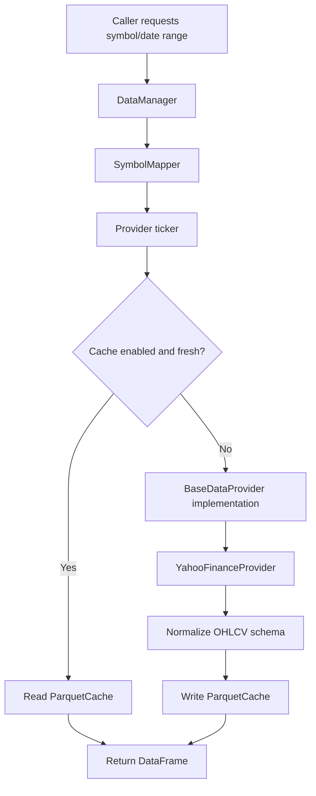

# trading_data Module

## Purpose

The `trading_data` module is the platform data sourcing layer. It fetches daily OHLCV market data, normalizes provider-specific schemas, resolves friendly symbol names, and caches results as parquet files.

It is intended to give the rest of the system one clean contract:

```text
DatetimeIndex + open, high, low, close, volume
```

The main consumer modules are `market_regime`, `stock_regime`, and `runner`.

## What It Does

The primary entry point is `trading_data.manager.DataManager`.

It handles:

- Symbol resolution through `SymbolMapper`.
- Provider routing through a common provider interface.
- Cache-first reads from `ParquetCache`.
- Live data fetches through the active provider.
- Retry and backoff on provider failures.
- Normalization to a consistent OHLCV DataFrame.
- Batch fetching with per-symbol success/error results.

The implemented provider is Yahoo Finance. Zerodha, Polygon, and IBKR provider files are present as interface-compatible stubs.

## Inputs And Outputs

### Inputs

Typical call:

```python
from trading_data import DataManager

manager = DataManager()
df = manager.get_daily_data(
    symbol="NIFTY50",
    start="2021-01-01",
    end="2026-05-16",
)
```

Inputs include:

- `symbol`: canonical name or provider ticker, such as `NIFTY50`, `SP500`, `^NSEI`, or `AAPL`.
- `start` and `end`: date range.
- `interval`: default `1d`.
- `refresh`: when true, bypasses cache.
- `DataManagerConfig`: provider, cache directory, cache age, retry settings.

### Outputs

Single-symbol output:

```text
pandas.DataFrame
index: DatetimeIndex named date
columns: open, high, low, close, volume
```

Batch output:

```python
dict[str, FetchResult]
```

Cache output:

```text
.cache/ohlcv/<provider>/<interval>/<symbol>.parquet
```

## Code Flow

For `get_daily_data()`:

1. Resolve the requested symbol into a provider-specific ticker.
2. Check the parquet cache unless `refresh=True`.
3. Return cache data when present and fresh.
4. Fetch from the active provider on cache miss or stale data.
5. Normalize provider output into the standard OHLCV schema.
6. Write the result back to cache.
7. Return the DataFrame.

For `fetch_multiple_symbols()`:

1. Resolve all symbols.
2. Try provider-level batch fetch when available.
3. Normalize each returned DataFrame.
4. Wrap each symbol in a `FetchResult`.
5. Keep failures isolated so one bad symbol does not fail the full batch.

## Flow Diagram



## Main Directories

| Path | Responsibility |
|---|---|
| `manager.py` | Public data orchestration API. |
| `models.py` | Shared enums, dataclasses, and type aliases. |
| `exceptions.py` | Data-layer exception hierarchy. |
| `providers/base.py` | Abstract provider contract and normalization helper. |
| `providers/yahoo.py` | Active Yahoo Finance provider. |
| `providers/zerodha.py` | Zerodha provider skeleton. |
| `providers/polygon.py` | Polygon provider skeleton. |
| `providers/ibkr.py` | Interactive Brokers provider skeleton. |
| `cache/parquet_cache.py` | Local parquet cache implementation. |
| `symbols/mapper.py` | Canonical-to-provider symbol mapping. |
| `examples/basic_usage.py` | Usage examples. |

## Usage

Install dependencies:

```bash
pip install -r trading_data/requirements.txt
```

Fetch one symbol:

```python
from trading_data import DataManager

manager = DataManager()
df = manager.get_daily_data("SP500", start="2021-01-01", end="2026-05-16")
```

Fetch many symbols:

```python
results = manager.fetch_multiple_symbols(
    ["AAPL", "MSFT", "NVDA"],
    start="2021-01-01",
    end="2026-05-16",
)

for symbol, result in results.items():
    if result.success:
        print(symbol, result.data.shape)
    else:
        print(symbol, result.error)
```

## Provider Contract

All providers inherit from `BaseDataProvider` and must return normalized OHLCV data. This keeps downstream code independent of provider quirks such as column casing, adjusted close behavior, MultiIndex columns, or timezone-aware indexes.

## Relationship To Other Modules

- `market_regime` consumes benchmark OHLCV from this module.
- `stock_regime` consumes per-stock OHLCV and benchmark OHLCV from this module.
- `runner` uses `DataManager` as its only data access point.
